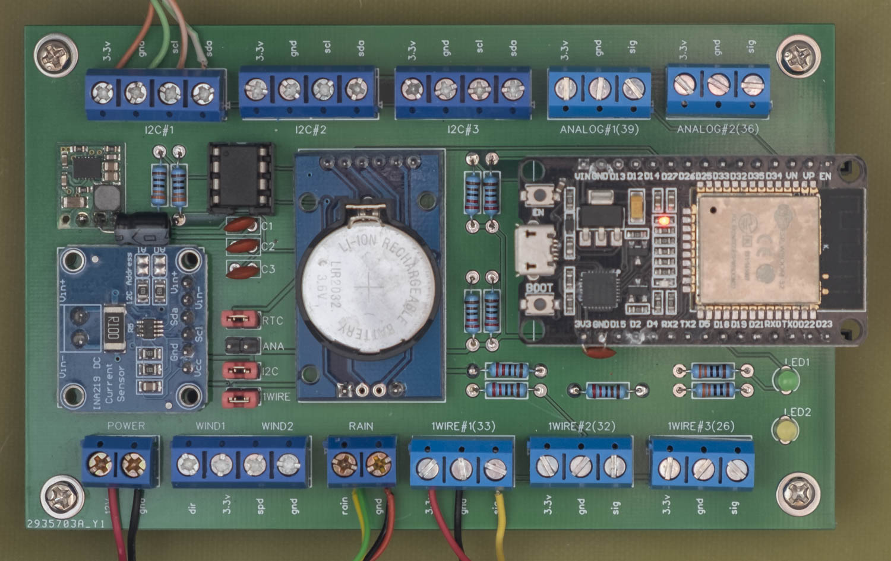

# YAOWS32

## Summary
Yet Another Open Weather Station (YAOWS32) is a weather station shield for ESP32 IoT dev board. Wind and rain sensors are accommodated as well as numerous other peripheral sensors via 3 x 1-Wire, 3 x I2C, and 2 x Analog headers.

Power consumption is kept low and battery/solar compatible by sleeping the ESP32 and waking it just long enough to sense weather conditions and upload to the cloud on a scheduled basis. Wind speed, direction and rain are sensed full time utilising a low power ATTiny85 running as an I2C “slave”.

It is designed to be powered by a 12v SLA battery which is in turn charged by a small 5w (or similar) 20v solar panel (note, the solar controller is not part of the core design).

## Objectives
Having owned a number of “cheap” Fine Offset weather stations that failed after a year or two, I had in mind to design and build something that would “go the distance” as well as be a platform to learn a little about Arduino, C++ and IoT.

As core Arduino boards are so pervasive, I originally started designing around Arduino Nano in a master slave configuration using 433Mhz to transmit data between an indoor master and outdoor slave. Eventually I discovered the ESP32 platform and decided an all-in-one outdoor approach best fit my needs (and greatly simplified the solution).

Outdoor sensors are prone to failure so being able to easily swap these out as well as future addition of a variety of other sensors such as UV and Soil temp, was paramount.

## Circuit
The prototype board was designed using EasyEDA. Version 1.1 of the board is available [here](https://easyeda.com/colwilliamsnz/YAOWS).

_Note: The 3231 RTC will likely be removed from a future design revision as it draws approx 700uA and adds very little to the overall solution VS the ESP32 onboard RTC and regular NTP time sync to keep any skew in check. In rev 1.1, the RTC can be omitted entirely from the board or disabled by removing the jumper marked “RTC”._

### Components
TBC

## Prototype

The original prototype board installed in its weather proof housing and [Stevenson screen](https://en.wikipedia.org/wiki/Stevenson_screen). A 5 watt 20v solar panel and weather proof box containing a 9000mAh SLA battery and PWM solar controller sit alongside. On the left is an I2C BMP180 pressure sensor in a custom made weather proof housing. A 1-Wire DHT22 temp/humidity sensor in a barrel type weather proof housing is installed on the right.

## Sensors

Wind and Rain: Fed up with the cheaper Fine Offset sensors that tend to turn “chalky” in UV intense New Zealand weather conditions, I opted for Davis Instruments 6410 Anemometer and 6462 Rain gauge. Fine Offset devices are also compatible —- these are commonly sold from Amazon, eBay etc.

Any rain gauge that generates a pulse to ground may be used. Any anemometer that generates a pulse to ground can be used. Any wind vane that is either a potentiometer OR resister network can be used but will need to be decoded first (ie, ADC readings determined against wind directions).

Temperature & Humidity: TBC

Pressure: TBC
