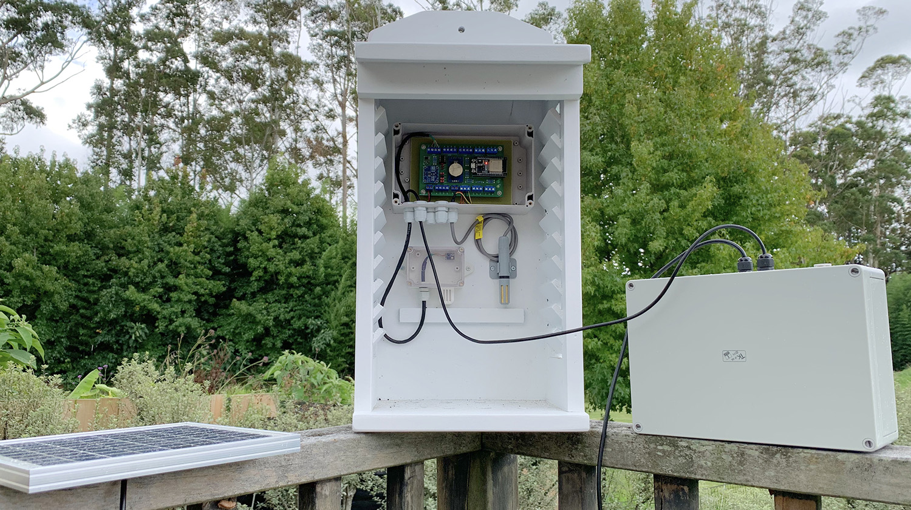

# YAOWS32

## Summary
Yet Another Open Weather Station (YAOWS32) is a weather station shield for ESP32 IoT dev board. Wind and rain sensors are accommodated as well as numerous other peripheral sensors via 3 x 1-Wire, 3 x I2C, and 2 x Analog headers.

Power consumption is kept low and battery/solar compatible by sleeping the ESP32 and waking it just long enough to sense weather conditions and upload to the cloud on a scheduled basis. Wind speed, direction and rain are sensed full time utilising a low power ATTiny85 running as an I2C slave.

It is designed to be powered by 12v SLA battery which is in turn charged by a small 5w (or similar) 20v solar panel (note, the solar controller is not part of the core design--there are numerous inexpensive solar controllers available on AliExpress etc that fill this duty nicely.

The code is Arduino C++, written in [Visual Studio Code](https://code.visualstudio.com) and [Platform IO](https://platformio.org).

## Objectives
Having owned a couple of low cost weather stations that failed after a year or two, I decided to design something that would go the distance whilst providing an ideal project to learn about Arduino, C++, and IoT.

As core Arduino boards are so pervasive and inexpensive, the design started out as a couple of Arduino Nano's in a master slave configuration using 433Mhz to transmit data between indoor "master" and outdoor "slave" units. Eventually I discovered the more powerful ESP32 platform and so the design morphed into an all-in-one outdoor solution.

Finally a robust system requiring next to no maintenance was also desirable as well as having expansion capability such that extra sensors could be added with only a few tweaks to the code.

## Circuit
The prototype circuit was designed using EasyEDA. Version 1.1 of the circuit design and PCB board is available [here](https://easyeda.com/colwilliamsnz/YAOWS_copy).

_Note: The 3231 RTC included in the v1.1 design is disabled via jumper and relevant code updated to remove it from operation. Whilst the ESP32 RTC does run a little fast (+3 seconds per hour in my prototypes), the accuracy of the external 3231 RTC is not worth the 700uA of current draw overhead it adds given this is intended to be a solar powered system. The ESP32 RTC can easily be kept accurate enough by regular updates using NTP._

### Components
TBC

## Sensors

Here follows are the sensors tested in my prototype. All are commonly available components that are enabled by adding in the appropriate library.

### Wind & Rain

I opted for Davis Instruments 6410 Anemometer and 6462 Rain gauge which I picked up second hand. The common Fine Offset units sold on Ebay, Amazon, etc are also compatible.

 

Practically any "tipping" rain gauge or anemometer that generates a pulse as it rotates may be used. Any wind vane that is either a potentiometer OR resister network can be used but will need to be decoded first (ie, ADC readings determined against wind directions).

 

### Temperature & Humidity

A 1-wire DHT11 was used. The version I have is housed in a very nice weather proof probe case including mounting hardware. There are identical looking AM2315 I2C versions also. These are not waterproof so still require sheltering from rain in some form of Stevenson screen.

 

### Pressure

I housed an I2C BMP180 in a custom weather proof case. These are accurate and inexpensive. Very nice custom housings for such sensors are available from [AliExpress](https://www.aliexpress.com/wholesale?catId=0&initiative_id=SB_20200507192408&SearchText=temperature+and+humidity+housing) and are worthwhile considering for long term installations.

## Prototype

The original prototype board is pictured below, installed in its weather proof housing and [Stevenson screen](https://en.wikipedia.org/wiki/Stevenson_screen). A 5 watt 20v solar panel and weather proof box containing a 9000mAh SLA battery and PWM solar controller sit alongside.

_Note: the solar plant is oversized as I intended it to double as an emergency power supply for charging phones during power outages--we often loose power in bad weather conditions where I live._

